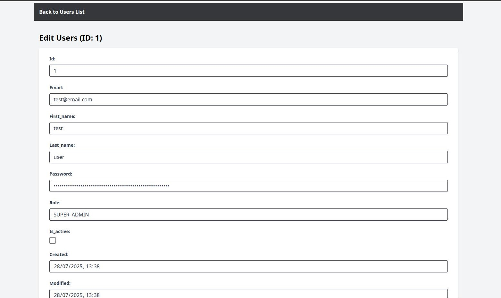
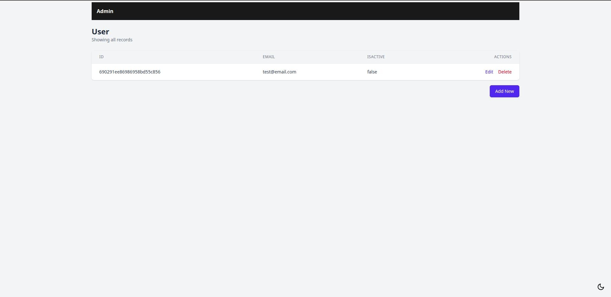

# Ktor Panel

[](https://central.sonatype.com/artifact/xyz.daimones/ktor-panel)
[](https://ktor-panel.daimones.xyz)
[](https://github.com/believemanasseh/ktor-panel)
[](https://kotlinlang.org)
[](https://ktor.io/)
[](LICENSE)

A lightweight, customisable admin interface library for Ktor applications. Ktor Panel provides a simple way to manage
your database entities through an intuitive and secure web interface with minimal configuration.

<p style="display: flex; flex-wrap: wrap; justify-content: center; flex-direction: row;">
  
  
</p>

## Live Demo

Try the live demo here: [https://ktor-panel.daimones.xyz](https://ktor-panel.daimones.xyz)

> **Note:**  
> Use `admin` as both the username and password to log in to the demo.

## Installation

### Gradle (Kotlin DSL)

```kotlin
dependencies {
  implementation("xyz.daimones:ktor-panel:0.2.0")
}
```

### Gradle (Groovy)

```groovy
dependencies {
  implementation 'xyz.daimones:ktor-panel:0.2.0'
}
```

### Maven

```xml

<dependency>
    <groupId>xyz.daimones</groupId>
    <artifactId>ktor-panel</artifactId>
  <version>0.2.0</version>
</dependency>
```

## Quick Start

### Basic Setup

```kotlin
// Import necessary components
import xyz.daimones.ktor.panel.Admin
import xyz.daimones.ktor.panel.Configuration
import xyz.daimones.ktor.panel.EntityView
import org.jetbrains.exposed.sql.Database

fun Application.configureAdminPanel(database: Database) {
    // Create admin configuration 
    val config = Configuration(
        url = "admin",           // Access at /admin
        adminName = "My App Admin"
    )

    // Initialise admin panel
    val admin = Admin(this, config, database)

    // Add your entities to the admin panel 
    admin.addView(EntityView(User::class))
    admin.addView(EntityView(Product::class))
}
```

### Add to your Ktor application

```kotlin
fun Application.module() {
    // Configure other Ktor features
    install(ContentNegotiation) {
        json()
    }

    // Setup your database connection
    val database = Database.connect(
        "jdbc:h2:mem:test;DB_CLOSE_DELAY=-1",
        driver = "org.h2.Driver"
    )

    // OPTIONAL: Install Mustache for templates (by default ktor-panel configures Mustache for rendering views)
    install(Mustache) {
        val roots = listOf("templates", "panel_templates")
        mustacheFactory = object : DefaultMustacheFactory() {
            override fun getReader(resourceName: String): Reader {
                for (root in roots) {
                    val stream = this.javaClass.classLoader.getResourceAsStream("$root/$resourceName")
                    if (stream != null) {
                        return stream.reader()
                    }
                }
                throw java.io.FileNotFoundException("Template $resourceName not found in $roots")
            }
        }
    }

    // Add admin panel
    configureAdminPanel(database)
}
```

## Customisation

### Custom Configuration

```kotlin
val config = Configuration(
    url = "dashboard",          // Change URL to /dashboard
    endpoint = "/",             // Set index endpoint
    setAuthentication = true,   // Enable authentication (default is true)
    adminName = "Custom Admin", // Change admin panel name
    adminUsername = "my_admin", // Set the default username
    adminPassword = "a_very_strong_password" // Set the default password
)
```

> **Important:** For production environments, always change the default `adminUsername` and `adminPassword`.

### Custom Templates

Create your own Mustache templates in your resources directory to override the defaults:

- `kt-panel-login.hbs` - Login form template
- `kt-panel-logout.hbs` - Logout template
- `kt-panel-index.hbs` - Main dashboard template
- `kt-panel-list.hbs` - List view for database records
- `kt-panel-create.hbs` - Form for creating new records
- `kt-panel-details.hbs` - Detailed view of a record
- `kt-panel-delete.hbs` - Confirmation for deleting records

## Testing

To run the tests for this project, you can use the following Gradle command:

```bash
./gradlew :lib:test
```

After running the tests, you can find:

- Test reports in the `lib/build/reports/tests/test/` directory
- Test coverage reports in the `lib/build/reports/jacoco/test/` directory

## Documentation

To build the Sphinx documentation, use the following command:

```bash
sphinx-build docs docs/_build
```

## Issues

If you encounter any bugs, problems, or have feature requests, please open an issue in
the [GitHub Issues](https://github.com/believemanasseh/ktor-panel/issues) section.

## Contributing
Contributions are welcome! Please feel free to submit a Pull Request.

1. Fork the repository
2. Create your feature branch (`git checkout -b feature/amazing-feature`)
3. Commit your changes (`git commit -m 'feat: Add some amazing feature'`)
4. Push to the branch (`git push origin feature/amazing-feature`)
5. Open a Pull Request

## License

This project is licensed under the BSD 3-Clause License - see the [LICENSE](LICENSE) file for details.

## Acknowledgments

- [Ktor](https://ktor.io/) - Kotlin async web framework
- [Exposed](https://github.com/JetBrains/Exposed) - Kotlin SQL library
- [Hibernate](https://hibernate.org/orm/documentation/7.0/) - Java ORM library
- [MongoDB Kotlin Driver](https://www.mongodb.com/docs/drivers/kotlin/coroutine/current/quick-start/) - Official MongoDB
  driver for Kotlin
- [Mustache](https://github.com/spullara/mustache.java) - Logic-less templates
- [Flask-Admin](https://github.com/flask-admin/flask-admin) - Inspiration for this project